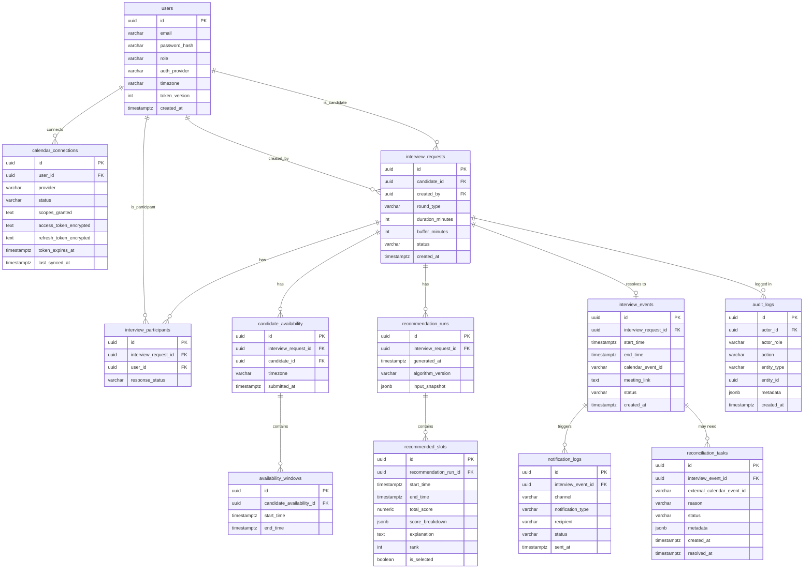

# Database Design — Smart Interview Scheduler

Status: updated in the Architecture Consistency Pass. Changes from the prior revision: `calendar_connections` gains lifecycle fields (`status`, `scopes_granted`) to support the separated Google Login/Calendar OAuth model; a new `reconciliation_tasks` table supports the compensating-action booking strategy; the Concurrency Strategy section is rewritten to explicitly disclaim any distributed transaction across PostgreSQL and Google Calendar.

# Database Architecture

**PostgreSQL is the single source of truth** for every entity in the system. The data is inherently relational, and booking needs real ACID transactions — but only ACID **within PostgreSQL itself**. See §Concurrency Strategy for the explicit statement that no transaction spans PostgreSQL and Google Calendar together.

**Redis is used for two narrow purposes only:** a distributed lock during booking, and a short-TTL cache for computed free/busy data. Nothing in Redis is a loss-of-record if it disappears — a Redis restart degrades performance, never correctness.

**A note on which layer writes to which table (ties to `CODING_GUIDELINES.md`'s Engine/Service separation):** the Scheduling **Engine** never touches this database — it is a pure function. The Scheduling **Service** is the only code that calls the Repository to persist `recommendation_runs` and `recommended_slots`. This is a repeated point because it is the most common way this kind of design quietly degrades: it is easy to accidentally let the Engine "just quickly" write to the DB for convenience, and that must not happen.

---

# ERD



---

# Tables

### `users`
**Purpose:** every human account — Admin, Panelist, or Candidate.

| Column | Type | Constraints |
|---|---|---|
| id | UUID | PK, default `gen_random_uuid()` |
| email | VARCHAR(255) | UNIQUE, NOT NULL |
| password_hash | VARCHAR(255) | nullable (OAuth-only users have none) |
| name | VARCHAR(255) | NOT NULL |
| role | VARCHAR(20) | NOT NULL, CHECK IN ('ADMIN','PANELIST','CANDIDATE') |
| auth_provider | VARCHAR(20) | NOT NULL, DEFAULT 'PASSWORD', CHECK IN ('PASSWORD','GOOGLE') — **this reflects the login method only and has no bearing on Calendar access; see `calendar_connections` below** |
| timezone | VARCHAR(64) | NOT NULL, DEFAULT 'UTC' — IANA zone name |
| token_version | INTEGER | NOT NULL, DEFAULT 0 — incrementing revokes all outstanding refresh tokens |
| created_at | TIMESTAMPTZ | NOT NULL, DEFAULT now() |

Indexes: unique index on `email`.

### `calendar_connections`
**Purpose:** stores a panelist/admin's connected Google **Calendar** OAuth grant — entirely separate from the login mechanism above. A row existing here (with `status = 'CONNECTED'`) is the only thing that means "this user's calendar can be read/written"; `users.auth_provider = 'GOOGLE'` means nothing about Calendar access on its own.

| Column | Type | Constraints |
|---|---|---|
| id | UUID | PK |
| user_id | UUID | FK → users(id), NOT NULL, ON DELETE CASCADE |
| provider | VARCHAR(20) | NOT NULL, DEFAULT 'GOOGLE' — the narrow seam that keeps Outlook a scoped future addition |
| status | VARCHAR(20) | NOT NULL, DEFAULT 'DISCONNECTED', CHECK IN ('CONNECTED','EXPIRED','REVOKED','DISCONNECTED') — see `requirements.md` §9c for the transition diagram |
| scopes_granted | TEXT | NOT NULL, DEFAULT '' — space-separated scope list actually granted, recorded for audit/debugging of scope-related failures |
| access_token_encrypted | TEXT | nullable (absent while `DISCONNECTED`) |
| refresh_token_encrypted | TEXT | nullable |
| token_expires_at | TIMESTAMPTZ | nullable |
| last_synced_at | TIMESTAMPTZ | nullable |

Constraints: UNIQUE(`user_id`, `provider`). Indexes: on `user_id`; on `status` (the recommendations flow filters on `status = 'CONNECTED'`).

**Only free/busy or event-creation calls against a row with `status = 'CONNECTED'` are ever attempted** (FR-010). A `REVOKED` or `EXPIRED`-with-failed-refresh row causes a fast, specific error, never a fallback guess about that panelist's availability.

### `interview_requests`
**Purpose:** the central entity — one row per interview round being scheduled.

| Column | Type | Constraints |
|---|---|---|
| id | UUID | PK |
| candidate_id | UUID | FK → users(id), NOT NULL |
| created_by | UUID | FK → users(id), NOT NULL |
| round_type | VARCHAR(20) | NOT NULL, CHECK IN ('SCREENING','TECHNICAL','MANAGERIAL','HR') |
| duration_minutes | INTEGER | NOT NULL, CHECK > 0 |
| buffer_minutes | INTEGER | NOT NULL, DEFAULT 15 |
| status | VARCHAR(30) | NOT NULL, DEFAULT 'DRAFT' — see State Machine below |
| created_at | TIMESTAMPTZ | NOT NULL, DEFAULT now() |

Indexes: on `candidate_id`, on `created_by`, on `status`.

### `interview_participants`
**Purpose:** join table — which panelists (and the candidate, for query convenience) are on a request.

| Column | Type | Constraints |
|---|---|---|
| id | UUID | PK |
| interview_request_id | UUID | FK → interview_requests(id), NOT NULL, ON DELETE CASCADE |
| user_id | UUID | FK → users(id), NOT NULL |
| role_in_interview | VARCHAR(20) | NOT NULL, DEFAULT 'PANELIST', CHECK IN ('PANELIST','CANDIDATE') |
| response_status | VARCHAR(20) | NOT NULL, DEFAULT 'PENDING', CHECK IN ('PENDING','ACCEPTED','DECLINED') — **only meaningfully used once the Post-MVP decline workflow (`IMPLEMENTATION.md` Phase 9) is built; in the MVP, this stays `PENDING` for every row and does not gate scheduling, which relies on calendar free/busy, not manual acknowledgment** |

Constraints: UNIQUE(`interview_request_id`, `user_id`). Indexes: on `interview_request_id`, on `user_id`.

### `candidate_availability`
**Purpose:** one row per candidate submission event for a request.

| Column | Type | Constraints |
|---|---|---|
| id | UUID | PK |
| interview_request_id | UUID | FK → interview_requests(id), NOT NULL, ON DELETE CASCADE |
| candidate_id | UUID | FK → users(id), NOT NULL |
| timezone | VARCHAR(64) | NOT NULL — captured per submission, not read from `users.timezone` |
| submitted_at | TIMESTAMPTZ | NOT NULL, DEFAULT now() |

Indexes: on `interview_request_id`.

### `availability_windows`
**Purpose:** the actual time ranges within one candidate submission.

| Column | Type | Constraints |
|---|---|---|
| id | UUID | PK |
| candidate_availability_id | UUID | FK → candidate_availability(id), NOT NULL, ON DELETE CASCADE |
| start_time | TIMESTAMPTZ | NOT NULL |
| end_time | TIMESTAMPTZ | NOT NULL, CHECK (end_time > start_time) |

Indexes: on `candidate_availability_id`.

### `recommendation_runs`
**Purpose:** one row per invocation of the Scheduling Service (which in turn calls the pure Engine) for a request. **Written only by the Scheduling Service via its Repository — never by the Engine itself.**

| Column | Type | Constraints |
|---|---|---|
| id | UUID | PK |
| interview_request_id | UUID | FK → interview_requests(id), NOT NULL, ON DELETE CASCADE |
| generated_at | TIMESTAMPTZ | NOT NULL, DEFAULT now() |
| algorithm_version | VARCHAR(20) | NOT NULL — allows scoring weights to evolve without losing historical explainability |
| input_snapshot | JSONB | NOT NULL — the normalized availability/constraints the Engine actually ran against |

Indexes: on `interview_request_id`.

### `recommended_slots`
**Purpose:** the ranked, scored, explained candidate slots from one run — the persisted form of the product's core differentiator.

| Column | Type | Constraints |
|---|---|---|
| id | UUID | PK |
| recommendation_run_id | UUID | FK → recommendation_runs(id), NOT NULL, ON DELETE CASCADE |
| start_time | TIMESTAMPTZ | NOT NULL |
| end_time | TIMESTAMPTZ | NOT NULL |
| total_score | NUMERIC(4,3) | NOT NULL — 0.000–1.000 |
| score_breakdown | JSONB | NOT NULL — `{ "timezone_fairness": ..., "working_hours_comfort": ..., "scheduling_proximity": ..., "workload_balance": ..., "buffer_quality": ... }`, matching `requirements.md` §8 exactly |
| explanation | TEXT | NOT NULL |
| rank | INTEGER | NOT NULL |
| is_selected | BOOLEAN | NOT NULL, DEFAULT false — set true on the slot that was actually booked |

Indexes: on `recommendation_run_id`.

### `interview_events`
**Purpose:** the booked, calendar-confirmed outcome.

| Column | Type | Constraints |
|---|---|---|
| id | UUID | PK |
| interview_request_id | UUID | FK → interview_requests(id), NOT NULL, ON DELETE CASCADE |
| start_time | TIMESTAMPTZ | NOT NULL |
| end_time | TIMESTAMPTZ | NOT NULL |
| calendar_event_id | VARCHAR(255) | NOT NULL — populated from Google's response before this row is ever inserted (§Concurrency Strategy: the Calendar call happens first, outside the DB transaction) |
| meeting_link | TEXT | nullable (present whenever `conferenceData` succeeded, which is expected but not assumed) |
| status | VARCHAR(20) | NOT NULL, DEFAULT 'CONFIRMED', CHECK IN ('CONFIRMED','CANCELLED') |
| created_at | TIMESTAMPTZ | NOT NULL, DEFAULT now() |

Indexes: on `interview_request_id`; on `start_time`.

### `notification_logs`
**Purpose:** delivery record for every confirmation attempt (MVP scope: booking confirmation only; reminders/decline/cancel notices are added once Post-MVP Phase 9 is built).

| Column | Type | Constraints |
|---|---|---|
| id | UUID | PK |
| interview_event_id | UUID | FK → interview_events(id), NOT NULL, ON DELETE CASCADE |
| channel | VARCHAR(10) | NOT NULL, CHECK IN ('EMAIL') — SMS is not a valid value; it is mocked/simulated-only per `requirements.md` §5 and never reaches this table as a real send |
| notification_type | VARCHAR(20) | NOT NULL, CHECK IN ('CONFIRMATION','REMINDER','DECLINE','CANCELLATION','RESCHEDULE') — MVP writes only `CONFIRMATION` rows; the rest appear once Phase 9 is built |
| recipient | VARCHAR(255) | NOT NULL |
| status | VARCHAR(20) | NOT NULL, CHECK IN ('SENT','FAILED','SIMULATED') — `SIMULATED` covers the documented logged-fallback path from `requirements.md` §5 when real email delivery is deferred |
| sent_at | TIMESTAMPTZ | NOT NULL, DEFAULT now() |

Indexes: on `interview_event_id`.

### `reconciliation_tasks`
**Purpose:** new in this revision — the structured home for FIX 3's "compensating delete itself failed" case. A dedicated table beats overloading `audit_logs` here because this data is **actionable and mutable** (needs a `status` that moves from `OPEN` to `RESOLVED`), whereas `audit_logs` is deliberately immutable/append-only.

| Column | Type | Constraints |
|---|---|---|
| id | UUID | PK |
| interview_event_id | UUID | FK → interview_events(id), nullable — the local booking record may not exist if persistence never succeeded; the external event id is what matters here |
| external_calendar_event_id | VARCHAR(255) | NOT NULL — the orphaned Google Calendar event that needs manual/retry cleanup |
| reason | VARCHAR(50) | NOT NULL, e.g. `'COMPENSATING_DELETE_FAILED'` |
| status | VARCHAR(20) | NOT NULL, DEFAULT 'OPEN', CHECK IN ('OPEN','RESOLVED') |
| metadata | JSONB | NOT NULL, DEFAULT '{}' — original DB error, cleanup-attempt error, timestamps |
| created_at | TIMESTAMPTZ | NOT NULL, DEFAULT now() |
| resolved_at | TIMESTAMPTZ | nullable |

Indexes: on `status` (an operator/admin can query all `OPEN` reconciliation tasks — this is the manual-follow-up queue named in `requirements.md` §10).

### `audit_logs`
**Purpose:** immutable, append-only record of key state-changing actions.

| Column | Type | Constraints |
|---|---|---|
| id | UUID | PK |
| actor_id | UUID | FK → users(id), nullable (system-triggered actions have no human actor) |
| actor_role | VARCHAR(20) | NOT NULL, CHECK IN ('ADMIN','PANELIST','CANDIDATE','SYSTEM') |
| action | VARCHAR(50) | NOT NULL |
| entity_type | VARCHAR(30) | NOT NULL |
| entity_id | UUID | NOT NULL |
| metadata | JSONB | NOT NULL, DEFAULT '{}' |
| created_at | TIMESTAMPTZ | NOT NULL, DEFAULT now() |

Indexes: on `entity_type, entity_id`; on `created_at`.

---

# Relationships

- A `user` may have zero or one `calendar_connections` per provider — independent of `users.auth_provider` (FIX 2's core point, restated at the schema level).
- An `interview_request` has exactly one `created_by` and one `candidate_id`, and one-or-more `interview_participants`.
- A `candidate_availability` row belongs to exactly one `interview_request` and has one-or-more `availability_windows`.
- A `recommendation_run` belongs to exactly one `interview_request` and produces one-or-more `recommended_slots`.
- An `interview_request` resolves to **at most one active** `interview_event` (see Concurrency Strategy).
- An `interview_event` has one-or-more `notification_logs` and, only in the compensating-failure case, one-or-more `reconciliation_tasks`.
- `audit_logs` references any entity generically via `entity_type` + `entity_id`, deliberately not a strict FK.

---

# Status State Machines

### `interview_requests.status`

```
DRAFT
  → AWAITING_CANDIDATE_AVAILABILITY
  → READY_FOR_SCHEDULING
  → RECOMMENDED
  → BOOKED
  → COMPLETED

Branches from BOOKED (Post-MVP, Phase 9):
  BOOKED → RESCHEDULING → READY_FOR_SCHEDULING

Branches from READY_FOR_SCHEDULING:
  READY_FOR_SCHEDULING → FAILED   (no common slot found — MVP-relevant edge case, not a Post-MVP feature)

Reachable from any non-terminal state (Post-MVP, Phase 9):
  * → CANCELLED
```

**Note on tiering:** the MVP build exercises `DRAFT → ... → BOOKED` (and `→ FAILED` for the no-common-availability edge case, which is a resilience requirement, not a deferred feature). `RESCHEDULING` and `CANCELLED` are reachable states in the schema from day one (so the column's `CHECK` constraint doesn't need a later migration), but the *transitions into* them are only implemented once Post-MVP Phase 9 is built.

**Deliberate simplification (unchanged from prior revision):** there is no separate `CONFIRMED` state between `BOOKED` and `COMPLETED` — successful Calendar event creation *is* confirmation in this design.

### `interview_participants.response_status`
```
PENDING → ACCEPTED
PENDING → DECLINED
```
Only meaningfully driven once Phase 9 (Post-MVP) is built — see the table note above.

### `calendar_connections.status`
```
DISCONNECTED → CONNECTED     (successful OAuth callback)
CONNECTED → EXPIRED          (access token expiry detected)
EXPIRED → CONNECTED          (silent refresh succeeds)
EXPIRED → REVOKED            (refresh attempt fails)
CONNECTED → REVOKED          (a live API call fails with an authorization error)
CONNECTED → DISCONNECTED     (explicit user action)
```

### `reconciliation_tasks.status`
```
OPEN → RESOLVED   (manual or automated retry cleanup confirms the orphaned Calendar event is handled)
```

---

# Redis Design

| Key pattern | Purpose | TTL | Set by |
|---|---|---|---|
| `freebusy:{user_id}:{date_range_hash}` | Cached free/busy blocks for one participant over one queried date range | 15 minutes | Calendar module, on every fresh fetch |
| `lock:booking:{interview_request_id}` | Mutual-exclusion lock held for the duration of one booking attempt | 10 seconds (safety-net auto-expire) | Booking Service, via `SETNX` |
| `ratelimit:{user_id_or_ip}:{endpoint}` | Token-bucket counter for rate limiting | 60 seconds rolling window | Rate-limiting middleware |

Nothing in Redis needs persistence guarantees — every key is either a cache (rebuildable) or meaningful only for seconds (lock, rate-limit counter).

---

# Concurrency Strategy — How Double Booking Is Prevented (and What Is *Not* Claimed)

**Explicit disclaimer, per FIX 3:** there is no distributed transaction spanning PostgreSQL, Redis, and the Google Calendar API. The three systems are consistent with each other through a **compensating-action strategy**, not an atomic multi-system commit. This is a deliberate, documented, hackathon-appropriate trade-off — not an oversight.

**The eight-step booking sequence** (implemented in `app/booking/service.py`, matching `requirements.md` §10 and `CODING_GUIDELINES.md`'s illustrative code exactly):

1. Acquire `lock:booking:{interview_request_id}` in Redis (`SETNX`). Fails fast with `SLOT_NO_LONGER_AVAILABLE` if already held — this is the fast-path defense against the overwhelmingly common case (two near-simultaneous clicks).
2. Re-validate the selected `recommended_slots` row is still valid (still belongs to the latest `recommendation_run`, request still `RECOMMENDED`).
3. Check for conflicts (any existing `CONFIRMED` `interview_events` row for this request).
4. Call the Google Calendar API to create the event — **this happens outside any database transaction.** It is a plain external HTTP call with its own retry/backoff, not wrapped in `db.transaction()`.
5. On success, receive the external `calendar_event_id` and `meeting_link`.
6. **Only now** open a PostgreSQL transaction — Postgres-only, does not span step 4 — and insert `interview_events`, update `interview_requests.status → BOOKED`, and mark the winning `recommended_slots.is_selected → true`.
7. Commit the transaction.
8. Release the Redis lock (or let it expire — the 10-second TTL is a safety net, not the primary release mechanism).

**Failure handling, exhaustively, per FIX 3:**

| Failure point | What happens |
|---|---|
| Step 4 fails (Calendar API rejects/times out after retries) | No DB row is ever created. Lock is released. A clear `CALENDAR_EVENT_CREATION_FAILED` error is returned. Request remains `RECOMMENDED`. |
| Step 6 fails (DB write fails after step 4 succeeded) | **Compensating action:** the just-created Calendar event is deleted/cancelled via the Calendar API. The failure is logged. A recoverable `BOOKING_PERSISTENCE_FAILED` error is returned — the request remains `RECOMMENDED`, exactly as if booking had never been attempted, **if** the compensating delete succeeds. |
| The compensating delete (above) also fails | The external `calendar_event_id` is logged at error/critical severity, and a `reconciliation_tasks` row is created (`status = 'OPEN'`) for manual or automated retry follow-up. **The user-facing response still reports failure, never success** — even though an orphaned event may exist on Google's calendar until the reconciliation task is resolved. This is the one case where the system's internal state (no confirmed booking) and Google's calendar state (an orphaned event) can briefly disagree — the `reconciliation_tasks` table exists specifically to close that gap after the fact, out of band from the user-facing request. |

**A DB-level uniqueness constraint as the final line of defense**, independent of the Redis lock working correctly:

```sql
CREATE UNIQUE INDEX ON interview_events (interview_request_id) WHERE status = 'CONFIRMED';
```

This makes it structurally impossible for two `CONFIRMED` events to exist for the same request even if the Redis lock itself failed to acquire correctly (e.g., a Redis restart mid-demo) — it is what turns "should never happen" into "cannot happen" at the one layer (PostgreSQL) that actually offers that guarantee.

The automated tests required in `IMPLEMENTATION.md` Phase 7 cover all four rows of the failure table above (the three failure paths plus the double-booking race itself).
